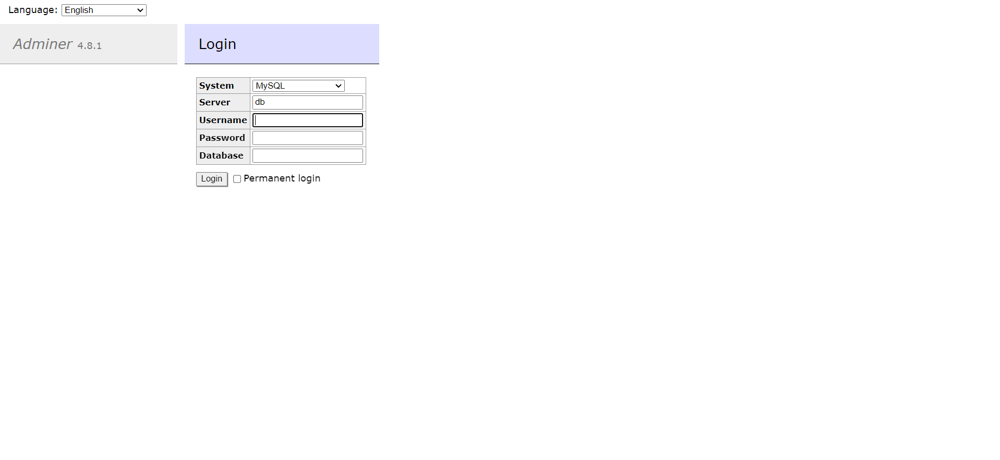
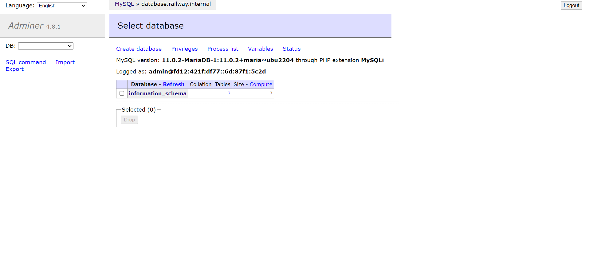
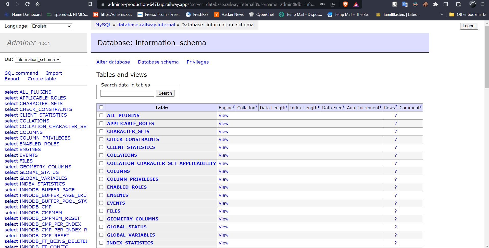
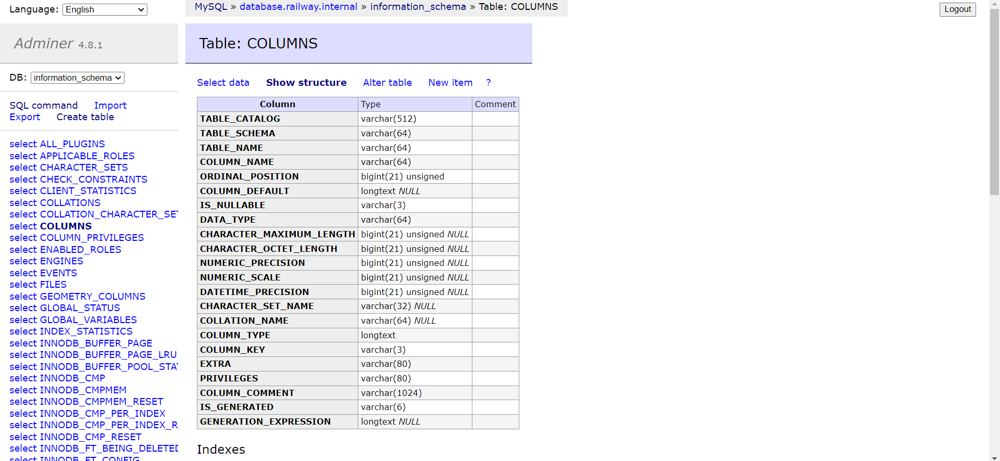
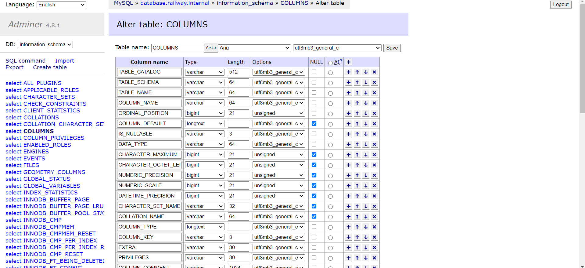
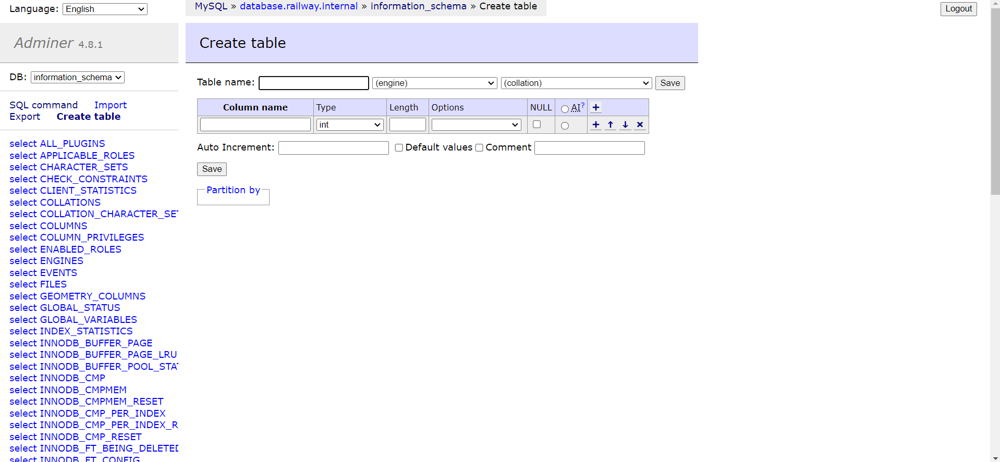
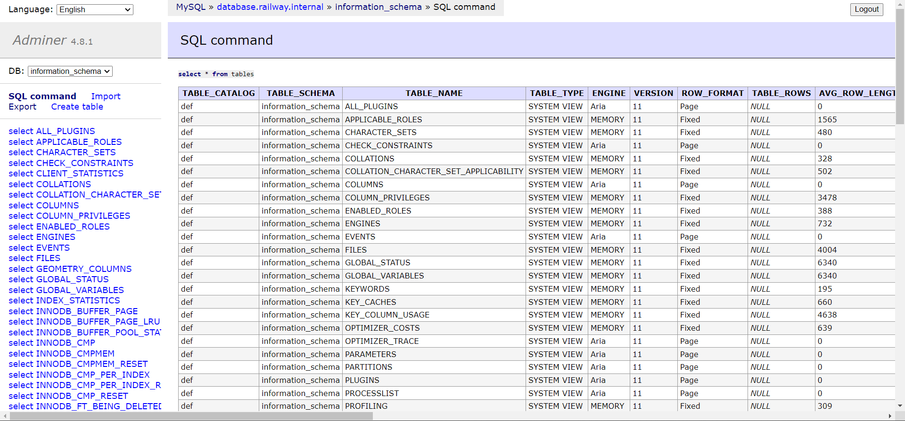

# MariaDB - Railway Template

This example deploys a self-hosted version of [MariaDB](https://mariadb.com/). MariaDB is a community-developed, commercially supported fork of the MySQL relational database management system (RDBMS), intended to remain free and open-source software under the GNU General Public License. 

## What is MariaDB?
MariaDB Server is one of the most popular database servers in the world. It's made by the original developers of MySQL and guaranteed to stay open source. Notable users include Wikipedia, DBS Bank, and ServiceNow.

The intent is also to maintain high compatibility with MySQL, ensuring a library binary equivalency and exact matching with MySQL APIs and commands. MariaDB developers continue to develop new features and improve performance to better serve its users.

## ✨ Services
- MariaDB
- Adminer (Web GUI for Database management)

## 💁‍♀️ How to use

- Click the Railway button 👆
- Add the required environment variables. For more environment variables check the [official docs](https://mariadb.com/kb/en/mariadb-server-docker-official-image-environment-variables/)
- `init_db.sql` & `create_user.sql` are custom scripts that will be executed on startup. You can customize them as per your needs.
- Deploy
- To access the Adminer GUI, use the railway public url. For example: `https://<project-name>.up.railway.app/`

- You can login into adminier with Server as `database` and username & password which you configured during service configuration or you can find under environmental variable for database service in Railway UI.
- You can utilize the railway internal network to connect to the database from other services.  For example `database.railway.internal` should be your database host.
- You can view list of databases and tables in the Adminer GUI

- To view tables within a database, click on the database name

- Adminer also provides option to view table column infomration 

- You can edit and modify table structure using Adminer

- Table can be created from UI as well

- It also provider option to execute custom sql queries. By clicking on `SQL Command` you should be able to write your own sql and query the table you want.

- To include your application make sure to create a separate folder and add new service. Use internal network to connect to db.
- Enjoy!

## 📝 Notes

- Source repo: https://github.com/MariaDB/mariadb-docker
- Docs: https://mariadb.com/kb/en/
- Adminer: https://www.adminer.org/